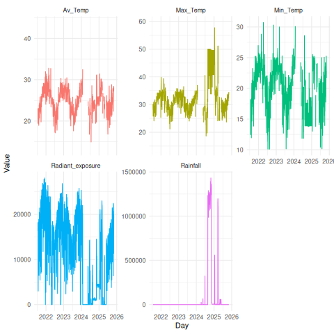

---
layout: default
title: Home

# ERC Met Station Data

Welcome! This site summarises environmental data collected for the ERC.

The Environmental Research Complex (ERC) is a cutting edge research facility for biological and environmental sciences at James Cook University, Cairns.

## Latest Plots

## Download Data
[Download summarized data](/assets/data/2025-11-19_Current_cleaned_daily.csv)

